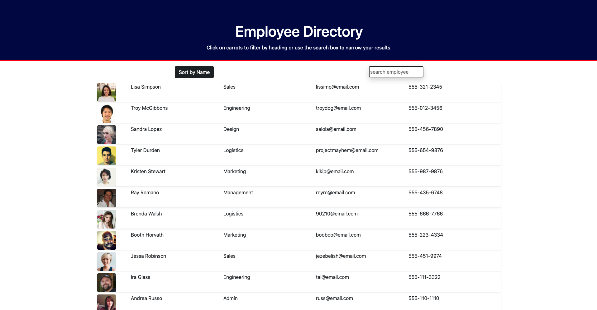

# Employee Directory

## Description ✏️

The Employee Directory allows the user to view at-a-glance, employees data, sorts employees by name and allows users to filer by employee's first name. 

### User Story:

````
As a user, 
I want to be able to view my entire employee directory at once. 
So that I have quick access to their information.
````
https://karm3nz.github.io/Employee-Directory/



## Table of Contents 📜

* [Installation](#installation)
* [License](#license)

## Installation 
💾

* Make sure to have a text editor of your choice installed (the example below shows "Visual Studio Code").
* Install node.js here: https://nodejs.org/en/download/.
* From the repository download zip file of the repository.
* Inside your computer's command-line interface, navigate into the file "develop".
* In the command-line "npm install" to install dependencies from the json package.
* Run the application by typing in the command line "npm start".

## License 
🛡️

MIT License

Copyright (c) [2021] [Carmen Hui]

Permission is hereby granted, free of charge, to any person obtaining a copy
of this software and associated documentation files (the "Software"), to deal
in the Software without restriction, including without limitation the rights
to use, copy, modify, merge, publish, distribute, sublicense, and/or sell
copies of the Software, and to permit persons to whom the Software is
furnished to do so, subject to the following conditions:

The above copyright notice and this permission notice shall be included in all
copies or substantial portions of the Software.

THE SOFTWARE IS PROVIDED "AS IS", WITHOUT WARRANTY OF ANY KIND, EXPRESS OR
IMPLIED, INCLUDING BUT NOT LIMITED TO THE WARRANTIES OF MERCHANTABILITY,
FITNESS FOR A PARTICULAR PURPOSE AND NONINFRINGEMENT. IN NO EVENT SHALL THE
AUTHORS OR COPYRIGHT HOLDERS BE LIABLE FOR ANY CLAIM, DAMAGES OR OTHER
LIABILITY, WHETHER IN AN ACTION OF CONTRACT, TORT OR OTHERWISE, ARISING FROM,
OUT OF OR IN CONNECTION WITH THE SOFTWARE OR THE USE OR OTHER DEALINGS IN THE
SOFTWARE.


